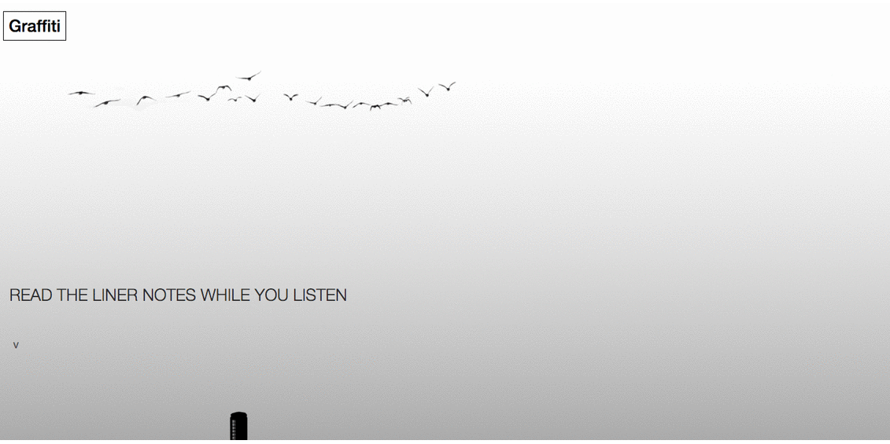

#Graffiti
### The music junkie's music player ###



#### User Notes ####

1. Enter artist name and hit enter
2. Click on image to play song. Liner notes will begin displaying.
3. Use carousel to pick more songs. Music is not yet auto-play.

#### Dev Notes ####

1. Fork, clone and cd to project root

```
git clone https://github.com/<your_github_name>/mvp.git
cd mvp
```

2. Install dependencies

```
npm install
bower install
```
3. In project root, create a 'keys.js' file where you'll keep your Genius + Youtube API keys for local dev.
   This file is in the .gitignore file so you don't have to worry about it being committed/tracked.

```
// command line
touch keys.js

// in keys.js
exports.geniusKey = 'YOUR_GENIUS_API_ACCESS_TOKEN';
exports.youtubeKey = 'YOUR_YOUTUBE_DATA_API_CLIENT_KEY';
```
